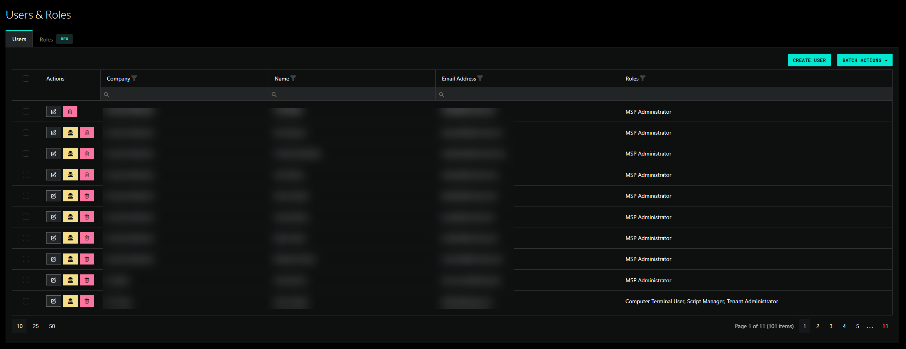
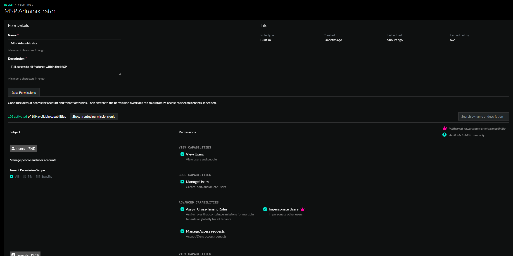

# Role-Based Access Control (RBAC) System (In Active Development)

ImmyBot's RBAC system provides granular permission management, allowing you to control exactly what users can access and modify within your environment. This system has been designed with a phased approach to ensure seamless migration from legacy permissions while introducing powerful new capabilities.

## Development Roadmap

Our RBAC implementation follows a structured 5-goal approach, ensuring stability and backward compatibility throughout the transition.

### ✅ Goal 1: Migrate to RBAC Behind the Scenes (Complete)

**Objective**: Seamlessly transition from legacy permissions to RBAC without breaking changes or requiring user reconfiguration. Doing this allowed us to iteratively battle-test the changes to the backend over time.

**Status**: Complete - Implemented and released over the past 8 months

**Achievement**: Full feature parity with the existing permission system while laying the foundation for advanced RBAC capabilities.

---

### Goal 2: Expose RBAC in the UI - In Progress (90% complete)

**Objective**: Provide a clear, intuitive UI for managing users and understanding current permissions.

**Objective**: Provide a new user management experience that maintains feature parity with current capabilities while providing insight into which specific permissions users have.

**Status**: 90% complete - A few tasks remain, but the feature is almost across the finish line and is currently available under a feature flag for early testing.

#### Built-In Roles

The system includes four primary access levels that mirror existing permission structures:

| Role | Access Level | Description |
|------|-------------|-------------|
| **MSP Administrator** | Full System | Complete administrative access across all tenants |
| **MSP User** | Restricted System | Broad access with specific limitations |
| **Tenant Administrator** | Full Tenant | Complete access within assigned tenant(s) |
| **Tenant User** | Restricted Tenant | Limited access within assigned tenant(s) |

*Additional built-in roles maintain compatibility with existing application preferences and toggles.*

#### Interface Screenshots

**User Management View**
- Overview of all users and their assigned roles
- Quick access to user modification and role assignment

**Role Overview**
- Summary of all roles and user assignment counts
- Easy identification of role distribution

**Permission Details**
- Detailed breakdown of permissions for each role
- Clear understanding of what each role can access

---

### Goal 3: Role Assignments with Tenant Scopes - (70% complete)

**Objective**: Enable flexible role assignment across different tenant scopes.

Today, your msp users are hard mapped to allow access to all tenants, and your non-msp users are hard mapped to only access their own tenant. Role assignments will allow you to define where a user's permissions apply. Users can have multiple assignments with different scopes, providing precise access control.

**Status**: 70% complete - All of the groundwork is completed. We are now in the later stages, mostly focusing on ensuring all of the different scopes across different resource types work as expected.

#### Available Scopes

##### 🏢 Owner Scope
- **Coverage**: All tenants in the instance
- **Use Case**: System-wide administration
- **Requirement**: Cross-tenant role assignment permission

##### 🏬 MSP Scope
- **Coverage**: All tenants within selected MSP (including MSP tenant itself)
- **Use Case**: MSP-level management
- **Requirements**:
  - Cross-tenant role assignment permission
  - MSP tenant selection via dropdown

##### 🏷️ Tag Scope
- **Coverage**: All tenants with specified tag
- **Use Case**: Group-based management
- **Requirements**:
  - Cross-tenant role assignment permission
  - Tag selection via dropdown

##### 🎯 Specific Tenant Scope
- **Coverage**: Individual selected tenant
- **Use Case**: Single tenant administration
- **Requirement**: Cross-tenant role assignment permission

##### 👤 User's Tenant Scope
- **Coverage**: Current user's tenant only
- **Use Case**: Self-service tenant management
- **Requirement**: Basic user management permission

---

### Goal 4: Role Assignments with Resource Scopes (70% complete)

**Objective**: Provide granular control over specific resources within assigned tenants.

Resource scopes define exactly which resources a role can access, starting with computer resources.

**Status**: 70% complete - We aim to release computers as the initial resource scope to minimize the involved changes. Most of the work has been completed.

#### Computer Resource Scopes

##### Individual Computer
- **Target**: Specific selected computer
- **Use Case**: Technician assigned to particular machines

##### Tag-Based
- **Target**: All computers with specified tag
- **Use Case**: Department or function-based access (e.g., "HR-Computers")

##### Computer Type
- **Target**: Computers matching specified type criteria
- **Available Types**:
  - All computers
  - Workstations and Portable Devices
  - Servers
  - Domain Controllers

---

### Goal 5: Custom Roles - (80% complete)

**Objective**: Enable creation of tailored roles with specific permission combinations.

**Status**: 80% complete - This feature is almost completed and is in final testing

Custom roles provide the ultimate flexibility in permission management, allowing you to:
- Create roles with precisely the permissions you need
- Combine permissions in ways that match your organizational structure
- Reduce over-privileging by granting only necessary access

## Benefits of the New RBAC System

### Enhanced Security
- **Principle of Least Privilege**: Grant only necessary permissions
- **Granular Control**: Fine-tune access at tenant and resource levels
- **Audit Trail**: Clear visibility into who has access to what

### Operational Efficiency
- **Flexible Assignment**: Multiple role assignments per user
- **Scope-Based Management**: Organize access by business structure
- **Automated Expiration**: Time-limited access for temporary users

### Scalability
- **Multi-Tenant Ready**: Built for MSP environments
- **Tag-Based Organization**: Logical grouping of resources
- **Custom Role Creation**: Adapt to changing business needs

## Migration Path

The RBAC system has been designed for seamless transition:

1. **Zero Disruption**: Existing permissions continue working unchanged
2. **Gradual Adoption**: Enable new features as needed
3. **Backward Compatibility**: Legacy configurations remain functional
4. **Training-Free Transition**: Familiar interface with enhanced capabilities

## Next Steps

As we complete the final goals, users will gain access to:
- Complete resource scoping across all ImmyBot resources
- Full custom role creation capabilities
- Advanced permission combinations
- Enhanced reporting and audit features

*Stay tuned for updates as we finalize these powerful new capabilities.*