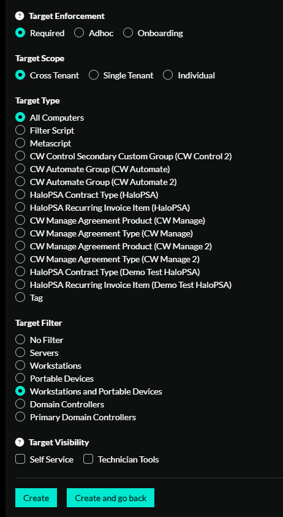

# Datto RMM

## Overview
This document will detail how to deploy Datto RMM with ImmyBot.

ImmyBot does not currently have an integration with Datto RMM

## Prerequisites
- An active ImmyBot subscription or trial
- Admin access to Datto RMM
- Knowledge of creating and managing [Deployments](/Documentation/HowToGuides/creating-managing-deployments)

## Process
### Create the Datto RMM API User
1. Navigate to **Setup** > **Global Settings** > **Access Control**.
2. Turn on the Enable API Access toggle.
   
4. Navigate to **Setup** > **Users**, and click the username that you would like to enable API access for.

5. Click Generate API Keys to generate an API Key and an API Secret Key for this user.

::: info  The API URL field is added to the individual user page once API keys have been generated for the user.
:::

6. The API Key and the API Secret Key will be displayed. Make a note of these and the API URL somewhere safe.

::: danger  Important
The API Secret Key will be hidden for security reasons after navigating away from this page. It will not be possible to retrieve it again. However, you can regenerate API keys at any time by returning to the page and clicking Generate API Keys. This will invalidate any keys previously generated. Similarly, clicking Delete API Keys will revoke access altogether. Regenerating and deleting API keys is irreversible, and you must confirm the action by clicking **Confirm** in the confirmation dialog box.

:::

7. Click Save User.

### Set up the ImmyBot Deployment
 1. Click on **Deployments** and then Click on **New**
 2. Select Datto RMM from the Software / Task drop down
 3. Select the radial button labeled **Installed** under the **Software should be**
 4. Select the **Latest** radial button under **Desired Version**
 5. In the parameter box, input the APIKey, the APISecret and the API URL that you made note of.
   ::: details 📷
   
   :::
 6. Select the radial button labeled **Required** under **Target Enforcement**
 7. Select the radial button labeled **Cross Tenant** under **Target Scope**
 8. Select the radial button labeled **All Computer** under **Target Type**
 9.  Select the radial button labeled **No Filter** under **Target Filter**
 10. Click on **Create** to save your deployment.
   ::: details 📷
   
   :::
Now the next time a session is run against a targeted computer, Datto RMM will get installed.

   
>[!NOTE] Document information
>Author: Mark Gomez
 
>Date Published: 09/19/2025
> 
>Date Revised: N/A
> 
>Version Number: 1.0