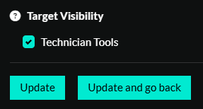
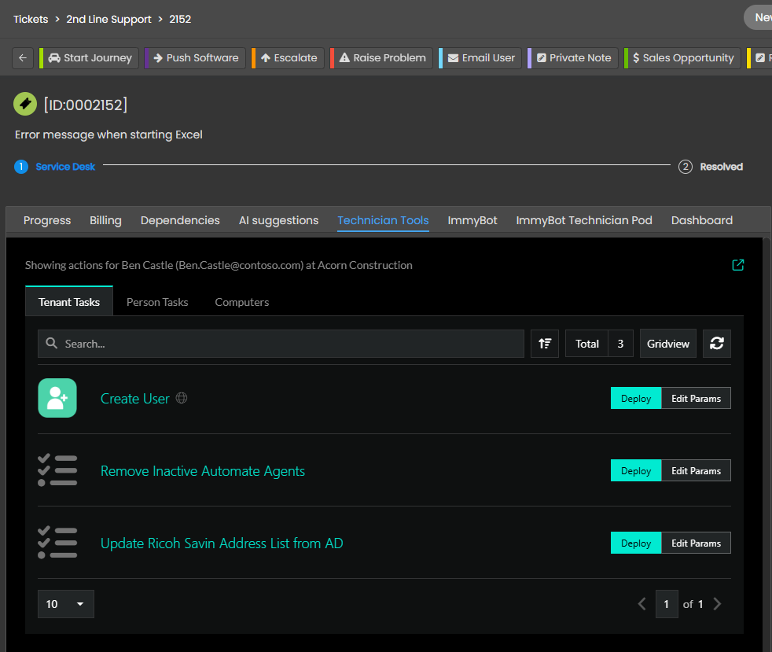
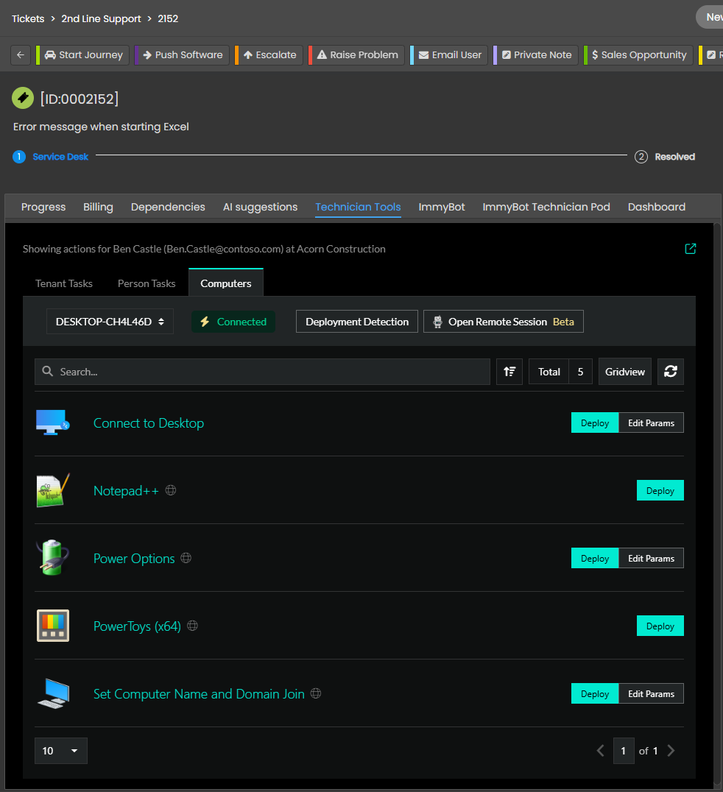

# ImmyBot Terminology Guide

This comprehensive guide explains the key concepts and terminology used throughout ImmyBot. Understanding these terms will help you navigate the platform more effectively and make the most of its powerful automation capabilities.

## Table of Contents

- [Tenants](#tenants)
- [User Computer Affinity](#user-computer-affinity)
- [Deployments](#deployment)
- [Targets](#target)
- [Maintenance Sessions](#maintenance-session)
- [Maintenance Actions](#maintenance-action)
- [Software](#software)
- [Tasks](#task)
- [Scripts](#scripts)
- [Schedules](#schedules)
- [Integrations](#integrations)
- [Identification](#identification)
- [Target Visibility](#target-visibility)
- [Technician Tools](#technician-tools)

## Tenants

Tenants represent your customers or client organizations in ImmyBot. Each tenant is a separate entity with its own computers, users, and configurations.

**Key Points:**
- Tenants can be created manually or synced automatically from external systems
- We recommend syncing Tenants from ConnectWise Automate, Microsoft Azure, or other supported integrations
- Tenants can be organized in a hierarchical structure with parent-child relationships
- Each tenant can have its own specific settings, deployments, and maintenance windows

## User Computer Affinity

User Computer Affinity is how ImmyBot associates users with their computers, enabling user-specific deployments and configurations.

**How It Works:**
- ImmyBot periodically runs `whoami /upn` on all computers and keeps a rolling list of the last 10 UPNs (User Principal Names)
- It assigns the Primary User of the computer to the "Person" (synced from Azure) with the matching UPN
- For environments without AzureAD, ImmyBot will lookup the UPN of the Person from a Domain Controller in the computer's Tenant
- This association enables targeting deployments to specific users' computers

## Deployment

A deployment is a rule that assigns [Software](#software) or [Tasks](#task) (collectively known as "Maintenance Items") to a [Target](#target). Deployments define what should be installed, configured, or maintained on specific computers or for specific users.

```mermaid
graph TD
    A[Deployment] --> B[Software or Task]
    A --> C[Target]
    C --> D[Computers]
    C --> E[Users]
    C --> F[Tenants]
```

**Key Concepts:**
- Deployments were originally called "Assignments" and are still called Assignments in the underlying system
- Deployments are conceptually similar to Group Policies in that they assign settings to a group of users or computers
- A deployment defines the desired state (e.g., installed, uninstalled, specific version) for software or tasks


**Important Note:** DO NOT BE AFRAID TO SAVE YOUR DEPLOYMENTS. THEY DO NOT APPLY AUTOMATICALLY.

If you want your Deployments to be applied automatically, you need to create a [Schedule](#schedules). Otherwise, deployments only take effect when maintenance is manually run or triggered by another event.

## Deployment Resolution

Deployment Resolution is the process by which ImmyBot determines which deployment "wins" when multiple deployments could apply to the same computer or user. This is essential for handling exceptions and special cases.

**Also known as:**
* Creating Exceptions
* "Winning" Deployments
* Dealing with Snowflakes

Like Group Policies have a "Winning Policy", ImmyBot must have a "Winning Deployment" for a given Maintenance Item on a computer. When multiple deployments target the same computer with conflicting settings, ImmyBot uses specific rules to determine which one takes precedence.

### Example Scenario

Let's say you have a customer "Contoso" that uses Adobe Acrobat instead of Adobe Reader, and you would like that to be installed instead.

**Step 1:** Create a Deployment that sets the desired state of Adobe Reader to Uninstalled for Contoso


**Step 2:** Create a Deployment that Installs Adobe Acrobat for their computers


**Result:** When maintenance runs on Contoso computers, Adobe Reader will be uninstalled and Adobe Acrobat will be installed, even if you have a global deployment that normally installs Adobe Reader on all computers.

## [Target](#target)
A "[Target](#target)" is a grouping of computers (or Tenants in the case of "Cloud Tasks")

ImmyBot's ability to resolve [Targets](#target) to a group of computers is perhaps its most powerful feature.

For example, you can select a Group of users from AzureAD (which includes on-prem synced groups, and Teams) and ImmyBot will automatically resolve that to the list of computers in use by the people in that group.

If you enable PSA integration, a [Target](#target) could be all computers covered under a certain type of Agreement, or computers covered by an Agreement that includes a certain product.

This is particularly useful for security software, help desk portals, or anything else in your stack that you may only want to be installed for customers that are paying you for it.

### Offboarding

Conversely, you could create Deployments that remove your stack for customers you are offboarding.
- Create an "Offboarding" product in your PSA
- Create a deployment for each of the pieces of software you would like removed setting the desired state to Uninstalled
- Target all customers with the "Offboarding" product on their agreement

Note: ImmyBot even honors the date range on additions, making scheduled offboarding easier if say the customer wants your software removed on the last day of the month.

## [Maintenance Session](#maintenance-session)

A [Maintenance Session](#maintenance-session) is conceptually similar to running gpupdate /force

In other systems, different types of maintenance happen on their own schedule. Windows Updates may run on Tuesday night, but Third Party updates may run on Wednesday night, and auto-fix tasks may run whenever an alert is fired for a failed monitor, which has its own polling interval.

By forcing all automation to happen in a sequential set of actions we call a [Maintenance Session](#maintenance-session), we can deliver predictability not only as to _what_ changes will be made, but also _when_.

This also provides a cohesive mechanism for setting up a new computer. At best in traditional RMMs you can assign Monitors that detect the absence of required software and run Install scripts when they are missing, but this doesn't scale as pre-requisites and exclusions are required.

Imagine if Group Policy could reliably deploy any type of software, and gpupdate /force worked reliably off-net, and when you ran it, it gave you real-time feedback about exactly what it was doing. Also imagine that it could optionally notify the end user before and after with a branded email telling them exactly what is being done, that optionally lets them cancel.

That's a [Maintenance Session](#maintenance-session).

You can view [Maintenance Sessions](#maintenance-session) for all computers under Computers->Sessions


Or, you can view [Maintenance Sessions](#maintenance-session) for a specific Computer under the Sessions tab for that Computer


## [Maintenance Session](#maintenance-session) Stages

### Detection Stage

During the Detection Stage, ImmyBot "Detects" which Maintenance Actions are necessary to bring the computer into compliance. These Actions are added to the [Maintenance Session](#maintenance-session).

This is a read-only process, and typically done while the user is active. This is so ImmyBot can notify the user of changes that will occur later during the Execution Stage. By doing this during the day, and scheduling Execution for later, we are giving the end user the best possible chance to be aware of the upcoming maintenance, Postponing if you allow. The Postpone feature is very popular among engineers that do may need to leave renderings and analysis tasks running overnight.

### Execution Stage


## [Maintenance Action](#maintenance-action)

```mermaid
flowchart TD
 SoftwareInstall --> Detect{Software Installed?}
 Detect --> |No| Install
 Detect --> |Yes| HasConfigurationTask{Has Configuration Task?}
 Install --> PostInstallDetect{Software Installed?}
 PostInstallDetect --> |Yes|HasConfigurationTask
 HasConfigurationTask --> |Yes| MaintenanceTaskTest{Run Test Script}
 MaintenanceTaskTest --> |return $true| Compliant
 MaintenanceTaskTest --> |return $false| RunSetScript(Run Set Script)
 RunSetScript --> PostMaintenanceTaskTest{Run Test Script}
 PostMaintenanceTaskTest --> |return $true| Compliant
 PostMaintenanceTaskTest --> |return $false| Non-Compliant
 PostInstallDetect --> |No| Non-Compliant
```

A *[Maintenance Session](#maintenance-session)* has one or more *[Maintenance Actions](#maintenance-action)*. A [Maintenance Action](#maintenance-action) could be to install software, apply a Windows Update, or run a [Task](#task).

The image below depicts a typical [Maintenance Session](#maintenance-session) with many [Maintenance Actions](#maintenance-action)


## Software
Software, in the context of ImmyBot refers to Software objects in My Software or Global Software.

My Software - Initially empty. When you upload your own software to ImmyBot, it goes into My Software

Global Software - Read-Only, managed by the ImmyBot team.

At the bare minimum, Software requires a [Detection Method](#detection-method).
Software can have many [Software Versions](#software-version).

```mermaid
graph TD
    C[Software] --> D[Custom Detection Script]
    C -->E[Default Uninstall Script]
    C --> F[Auto-Update Script]
```


### Pre-Requisities
This is a VERY powerful, and critically underrated feature in ImmyBot. ImmyBot resolves dependencies recursively, with built-in circular reference detection.

Common uses for Pre-Requisites include
* Ensuring a piece of software is installed before installing another
  * C++ Redistributables before 3CX Client
  * Office is installed before an Outlook Add-in
* Ensuring a piece of software is _uninstalled_ before install another
  * Removing Adobe Acrobat Reader before installing Adobe Acrobat Professional

### Install required dependencies


### Ordering [Maintenance Actions](#maintenance-action)


## Detection Method
A Detection Method is required in order to know whether or not a piece of Software is installed on a machine.

For Software, the detection method must returns the version of the software installed on the machine, if any.

For [Tasks](#task), the Detection Method is the "test" mechanism, which must return true or false to indicate whether or not the machine is in compliance.

## Software Version
```mermaid
graph TD
    C[Software Version] --> Install
    C --> Uninstall
    C --> Upgrade
    C --> Repair
    C --> Test
```

## Task
A Task (aka Mainenance Task) is a catch-all for anything that isn't software.

```mermaid
graph TD
    C[Task]
    C --> Get
    C --> Set
    C --> Test
```

or

```mermaid
graph TD
    C[Task]
    C --> S[Combined Script with $method parameter containing 'get','set', or 'test']
```

## Task Modes

### Enforce
Runs the "test" script, if the test returns false, runs "set", then runs "test" again to verify.

### Audit
Runs the "test" script which should return true or false. It can output whatever it wants, but the last output should be boolean.

### Monitor
Runs the "get" script, which can return anything. Useful for collecting data like Bitlocker Keys, Quickbooks Licenses, or any other piece of information you are interested in.

## Scripts
From the above diagrams, you can see that scripts are the building blocks for higher level objects like Software and Tasks.

## Execution Context
### System
Run as a service on the machine

### User
Will attempt to run as the logged on user

### Metascript
Runs in the ImmyBot backend, and can spawn code on the system by using Invoke-ImmyCommand

### Cloud Script
Runs in the ImmyBot backend, but intended to be run against a Tenant (perhaps for the purpose of getting or setting some setting in 365/Azure or some other system with an API). These are used exclusively in [Tasks](#task) targetting "Tenants".


## Schedules
Used to run maintenance periodically on machines. Can optionally be limited to a single Maintenance Item.

NOTE You must also have a Deployment for the Maintenance Item to set the desired state. Imagine a scenario where you need to ensure a single piece of software is up-to-date on all computers except for a CNC machine. Create 2 deployments, the first setting the desired state to Installed->Latest for all computers, then a second stating that the desired state is Ignored for the CNC machine. When you create the schedule, the software will be ignored for the CNC machine.

## Integrations

To ImmyBot, an RMM is a system that provides a list of computers, and a mechanism to run PowerShell scripts on them.


To avoid having to deploy the ImmyAgent to existing machines, ImmyBot optionally integrates with RMMs like ConnectWise Automate and ConnectWise Control and uses their agents instead. These systems are not as performant as the ImmyAgent, but can suppliment ImmyBot functionality.

For example, if you add an RMM Link for ConnectWise Control, you can open a remote session to the computer directly within ImmyBot:


If you add an RMM integration for ConnectWise Automate, Scheduled [Maintenance Sessions](#maintenance-session) will apply all Approved Windows Updates using the ConnectWise Automate API based on your Approval Policies in Automate Patch Manager.

You can even add multiple RMMs of the same type, which is often useful in merger and acquisition scenarios. You may choose to use ImmyBot as your single pane of glass to manage both, or simply let ImmyBot be a neutral third party for facilitating the consolidation of RMM agents to the parent company's RMM.

## Identification

Because the same computer often exists in multiple RMMs (Like how CW Automate typically installs CW Control Automatically), ImmyBot prevents duplicates by identifying the computer by a unique id. We DO NOT use MAC Address! This unique id persists even if you wipe and reload the machine.

When a new machine is detected, it first goes to New Computers->Actively Identifying


It uses the following script to collect the UUID from the machine:
```
gwmi Win32_ComputerSystemProduct | select -expand UUID
```

This value is static even if you wipe and reload the machine, although we have **VERY** rarely seen this value change following a BIOS upgrade or due to a mainboard fault. We chose this value instead of Mac Address or Hard Drive serial number because of issues other systems have with USB Ethernet cables and hard drive replacement. We did not use serialnumber because we learned that many computers do not have serial numbers.

In practice, this value works almost _too_ well. Machines you just wiped and expect to find in New Computers, are often associated to their pre-wiped computer objects. To find them, you often have to search for the serial number of the computer in the Computer List. In 0.40.1 we began using the Windows OfflineInstallationID value to identify when an existing computer has been wiped so we can set its status to "Needs Onboarding" which causes it to show up under New Computers as expected.

If it is a machine ImmyBot has seen before, it will be associated to the existing Computer, and you will find a new entry under the Computer's Agents tab. Under the hood we call these entries "RmmComputers".

Computers can have one or more RmmComputers(Agents). You can think of these as logical "pathways" to the computer. We only need one to be online to function.


## Target Visibility

The Target Visibility feature helps control where and how software deployments, task deployments, and other actions can be accessed in ImmyBot. There is currently one option:

[Technician Tools](#technician-tools): When enabled, this makes the deployment visible and accessible through the technician tools interface. This is useful for actions that can assist IT staff when working on support tickets.

This option is located at the bottom of the deployment details page.



## Technician Tools

Technician Tools is a specialized interface designed for IT technicians working within PSA (Professional Services Automation) tickets.

Think of it as a streamlined "command center" that gives technicians quick access to the tools and information they need while working on a support ticket, without having to switch between different systems or search for the relevant computers and software details.

### What it looks like

When a technician opens a ticket from their PSA system (like HaloPSA), this page shows relevant deployments from ImmyBot that resolved to that ticket.





### Deciding which deployments show up

Deployment [target visibility](#target-visibility) determines if it is enabled for a particular page.  Technician Tools is one of the available visibility options. When this option is selected and the deployment resolves to a person, tenant, or computer associated with the opened PSA ticket, it will show up in the list.

### Supported Integrations

- [HaloPSA](/halo-integration-setup.md#technician-tools)
- [CW Manage](/connectwise-manage-integration-setup)
